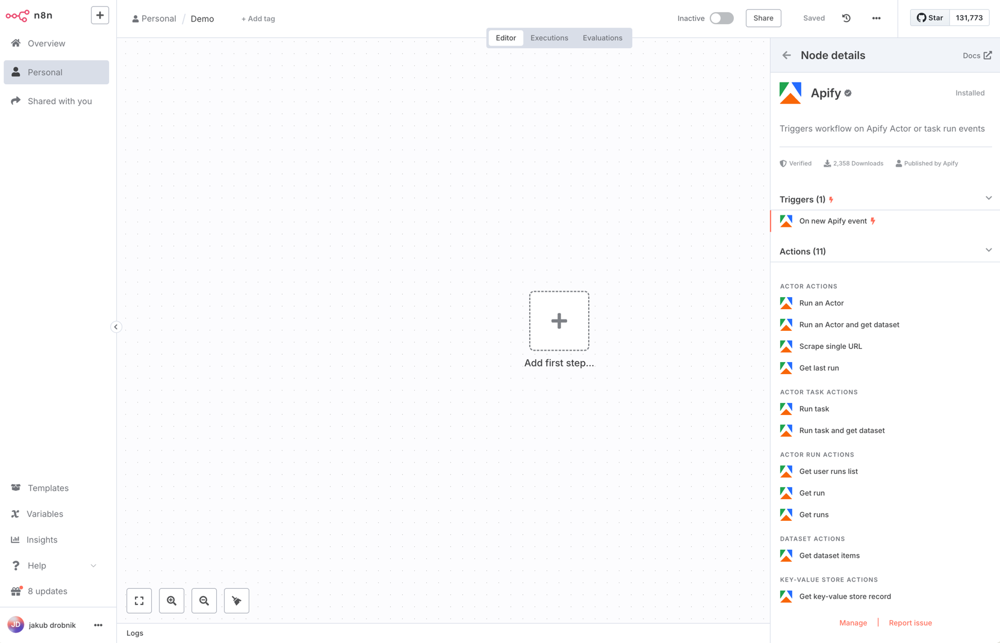

# n8n Nodes - Apify Integration

This is an n8n community node that integrates [Apify](https://apify.com) with your n8n workflows, enabling seamless web scraping, data extraction, and automation.

[Apify](https://apify.com) is a platform for developers to build, deploy, and publish web automation tools, while [n8n](https://n8n.io/) is a [fair-code licensed](https://docs.n8n.io/reference/license/) workflow automation tool that allows you to connect various services.

## Table of Contents

- [Installation](#installation)
- [Operations](#operations)
- [Credentials](#credentials)
- [Compatibility](#compatibility)
- [Usage](#usage)
- [Resources](#resources)
- [Version History](#version-history)
- [Troubleshooting](#troubleshooting)

## Installation

### ⚙️ Prerequisites

- Node.js (recommended: v18.10+)
- pnpm installed globally

---

### 1. Initialize n8n locally

Begin by installing and running n8n to create the necessary configuration directory (`~/.n8n`):

```bash
npm install -g n8n # Skip this step if you already have n8n installed globally
n8n start # This will generate the ~/.n8n directory
```

### 2. Clone & Build the Node Package

Install dependencies and build the node:

```bash
pnpm install
pnpm run build
```

### 3. Link the Custom Node to n8n

Create the `custom` directory inside `~/.n8n` (if it doesn't exist), then symlink your local node package:

```bash
mkdir -p ~/.n8n/custom
ln -s /full/path/to/n8n-nodes-apify ~/.n8n/custom/n8n-nodes-apify # replace full/path/to with the path to your n8n-nodes-apify directory
```

> **Note:** Use the absolute path in the symlink for compatibility.

### 4. Restart n8n

Now that your custom node is linked, start n8n again:

```bash
n8n start
```

---

### 🔁 Making Changes

If you make any changes to your custom node locally, remember to rebuild and restart:

```bash
pnpm run build
n8n start
```

---

## Self-Hosted n8n: Public Webhook URL for triggers

This configuration is required for our service's trigger functionality to work correctly.

By default, when running locally n8n generates webhook URLs using `localhost`, which external services cannot reach. To fix this:

1. **Set your webhook URL**  
In the same shell or Docker environment where n8n runs, export the `WEBHOOK_URL` to a publicly-accessible address. For example:
  ```bash
  export WEBHOOK_URL="https://your-tunnel.local"
  ```
2. **Restart n8n** 
  ```bash
  pnpm run build
  n8n start
  ```

## Operations



This node supports a wide range of Apify operations, organized by resource type:

### Actors
- **Run Actor**: Execute an actor with optional input parameters
  - Supports custom input JSON
  - Configurable timeout and memory limits
  - Build version selection
- **Scrape Single URL**: Quick scraping of a single URL
- **Get Last Run**: Retrieve information about the most recent actor run


### Actor Tasks
- **Run Task**: Execute a predefined actor task
  - Supports custom input JSON
  - Configurable timeout
  - Task-specific settings

### Actor Runs
- **Get User Runs List**: List all runs for a user
  - Pagination support
  - Sorting options
  - Status filtering
- **Get Run**: Retrieve detailed information about a specific run

### Datasets
- **Get Items**: Fetch items from a dataset

### Key-Value Stores
- **Get Key-Value Store Record**: Retrieve a specific record by key

### Triggers
  Automatically start an n8n workflow whenever an Actor or task finishes execution
  - Can be configured to trigger on success, failure, abort, timeout or any combination of these states
  - Includes run metadata in the output
  - Available triggers: 
    - **Actor Run Finished**: Start a workflow when an Actor run completes
    - **Task Run Finished**: Start a workflow when a task run completes


## Credentials

The node supports two authentication methods:

1. **API Key Authentication**
   - Configure your Apify API key in the n8n credentials section under `apifyApi`

2. **OAuth2 Authentication** (available only in n8n cloud)
   - Configure OAuth2 credentials in the n8n credentials section under `apifyOAuth2Api`


## Compatibility

This node has been tested with n8n version 1.57.0.

## Usage

1. **Create an Actor**: Set up a new actor on [Apify](https://apify.com).
2. **Set up a Workflow**: Create a new workflow in n8n.
3. **Add the Apify Node**: Insert the Apify node into your workflow.
4. **Configure Credentials**: Enter your Apify API key and actor ID.
5. **Select an Operation**: Choose the desired operation for the node.
6. **Execute the Workflow**: Run the workflow to execute the Apify operation.


## Resources

- [n8n Community Nodes Documentation](https://docs.n8n.io/integrations/community-nodes/)
- [Apify API Documentation](https://docs.apify.com)

## Version History

Track changes and updates to the node here.

## Troubleshooting

### Common Issues

1. **Authentication Errors**
   - Verify your API key is correct

2. **Resource Not Found**
   - Verify the resource ID format
   - Check if the resource exists in your Apify account
   - Ensure you have access to the resource

3. **Operation Failures**
   - Check the input parameters
   - Verify resource limits (memory, timeout)
   - Review the Apify console for detailed error messages

### Getting Help

If you encounter issues:
1. Check the [Apify API Documentation](https://docs.apify.com)
2. Review the [n8n Community Nodes Documentation](https://docs.n8n.io/integrations/community-nodes/)
3. Open an issue in the [GitHub repository](https://github.com/apify/n8n-nodes-apify)


